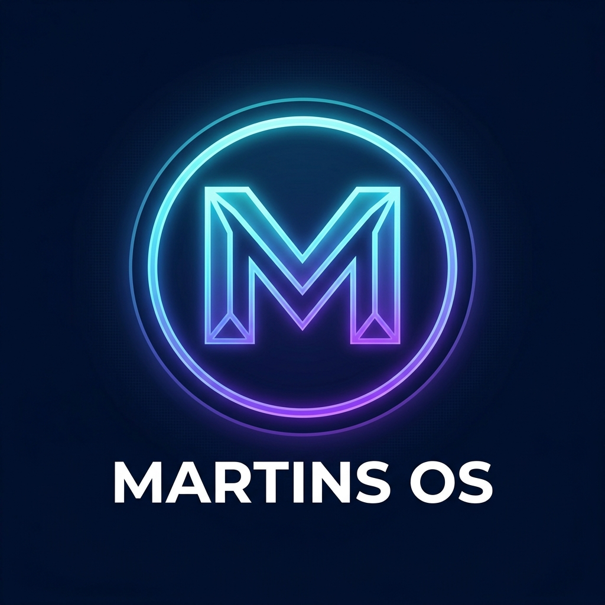

# 🚀 MartinsOS

<div align="center">
  

  <h3>Interface de Launcher para Linux — Estilo Gaming / TV OS</h3>

  
  
  
  
</div>

---

## 📖 O que é o MartinsOS?

**MartinsOS** é uma interface de launcher para Linux, inspirada em sistemas de TV/Console como Kodi e SteamOS. Ela substitui o desktop tradicional por um ambiente moderno, controlável por gamepad e otimizado para uso em televisores e PCs de sala de estar (HTPC).

### ✨ Funcionalidades

- 🎮 **Controle por Gamepad** — navegação completa via Xbox/PS com mapeamento visual interativo
- 🐳 **Integração Docker** — monitora e controla containers em tempo real
- 📡 **WebSockets** — atualizações de volume e mídia em tempo real
- 🎵 **Controle de Mídia** — play/pause/skip via controle (usa `playerctl`)
- 🔊 **Volume em Tempo Real** — barra de volume controlável via gatilhos
- 🌐 **Modo Web App** — abre sites em iframe dentro da interface ou em modo kiosk
- 📺 **Screensaver Automático** — ativado após 3 minutos de inatividade
- 🎨 **Temas** — Cosmos (roxo), Ocean (azul) e Ember (vermelho)
- 📱 **PWA** — instalável como Progressive Web App
- 🖥️ **Modo Kiosk** — inicia automaticamente ao ligar o sistema

---

## 📋 Compatibilidade

| Distro | Package Manager | Status |
|--------|----------------|--------|
| Ubuntu 22.04+ / Debian 11+ | `apt` | ✅ Testado |
| Arch Linux / Manjaro | `pacman` | ✅ Suportado |
| Fedora 38+ / RHEL 9+ | `dnf` | ✅ Suportado |
| openSUSE Leap / Tumbleweed | `zypper` | ✅ Suportado |

> O instalador detecta automaticamente o package manager e instala os pacotes corretos para cada distro.

### Requisitos mínimos

| Componente | Mínimo |
|------------|--------|
| Node.js | 18+ |
| Python | 3.10+ |
| RAM | 1 GB |
| Display Server | X11 ou Wayland |

### Dependências opcionais (instaladas automaticamente)

| Pacote | Função | Fallback |
|--------|--------|---------|
| `pulseaudio-utils` / `pipewire` | Controle de volume | desabilitado |
| `playerctl` | Controle de mídia | desabilitado |
| `btop` | Monitor de sistema | `htop` → `top` |
| `alacritty` | Terminal para logs | `xterm` |
| `chromium` / `chromium-browser` | Modo kiosk | qualquer Chromium |
| `scrot` / `gnome-screenshot` | Screenshots | desabilitado |

---

## 🚀 Instalação Rápida

```bash
# Clone o repositório
git clone https://github.com/alankazan/martinos.git
cd martinos

# Dê permissão e execute o instalador
chmod +x install.sh
./install.sh
```

O instalador detecta automaticamente sua distro e instala tudo que for necessário.

### Opções do instalador

```bash
./install.sh              # Instala + compila (produção)
./install.sh --autostart  # Instala + configura para iniciar com o sistema
./install.sh --dev        # Instala sem compilar (modo desenvolvimento)
```

---

## 🛠️ Instalação Manual

### 1. Instalar dependências do frontend

```bash
npm install
```

### 2. Instalar dependências do backend

```bash
pip3 install -r backend/requirements.txt
```

### 3. Build do frontend

```bash
npm run build
```

### 4. Iniciar em modo desenvolvimento

```bash
# Terminal 1 — Backend
cd backend && python3 server.py

# Terminal 2 — Frontend (dev)
npm run dev
```

Acesse: **http://localhost:5173**

---

## 🔧 Configuração de Autostart (Interface Principal do Sistema)

Para que o MartinsOS seja a **interface padrão ao ligar o Linux**, siga um dos métodos abaixo.

### Método 1: Systemd Services (Recomendado)

Cria dois serviços: um para o backend Python e um para abrir o Chromium em modo kiosk.

```bash
# Instala os serviços automaticamente
chmod +x install.sh
./install.sh --autostart
```

Ou manualmente:

```bash
# Copiar os arquivos de serviço
sudo cp deploy/martinos-backend.service /etc/systemd/system/
sudo cp deploy/martinos-kiosk.service   /etc/systemd/system/

# Habilitar e iniciar
sudo systemctl daemon-reload
sudo systemctl enable martinos-backend martinos-kiosk
sudo systemctl start  martinos-backend martinos-kiosk
```

### Método 2: Autostart com .xinitrc (X11)

```bash
echo 'exec /path/to/martinos/deploy/start-kiosk.sh' >> ~/.xinitrc
```

### Método 3: OpenBox / i3 autostart

```bash
echo '/path/to/martinos/deploy/start-kiosk.sh &' >> ~/.config/openbox/autostart
```

---

## 📁 Estrutura do Projeto

```
martinos/
├── backend/
│   ├── server.py          # Flask + SocketIO backend
│   ├── requirements.txt   # Dependências Python
│   └── start.sh           # Script de start do backend
├── deploy/
│   ├── martinos-backend.service  # Serviço systemd do backend
│   ├── martinos-kiosk.service    # Serviço systemd do kiosk
│   └── start-kiosk.sh            # Script de início do kiosk
├── public/
│   ├── logo.png           # Ícone do MartinsOS
│   └── controller.png     # Imagem do controle
├── src/
│   ├── components/        # Componentes React
│   ├── constants/         # Constantes e mapeamentos
│   ├── hooks/             # Hooks customizados (gamepad, socket)
│   ├── store/             # Estado global (Zustand)
│   ├── types/             # Tipos TypeScript
│   └── utils/             # Utilitários
├── install.sh             # Instalador automático
├── package.json
└── vite.config.ts
```

---

## 🎮 Configuração do Controle

1. Acesse o MartinsOS em **http://localhost:5173**
2. Clique em **Controle** na barra superior
3. Clique em qualquer botão na tela para remapear
4. Pressione o botão desejado no controle físico
5. Clique em **Salvar Mapeamento**

### Mapeamento Padrão (Xbox)

| Botão | Ação |
|-------|------|
| A | Confirmar / Abrir app |
| B | Voltar |
| X | Editar app |
| Y | Fixar / Desafixar |
| LB / RB | Volume ↓ / ↑ |
| LT / RT | Mídia anterior / próxima |
| D-Pad | Navegar |
| View | Abrir terminal |
| Menu | Configurações do app |

---

## 🔌 API do Backend

| Endpoint | Método | Descrição |
|----------|--------|-----------|
| `/api/launch` | POST | Lança um app |
| `/api/docker` | GET | Lista containers |
| `/api/docker/start` | POST | Inicia container |
| `/api/docker/stop` | POST | Para container |
| `/api/docker/logs` | POST | Abre logs no terminal |
| `/api/volume/level` | GET | Nível de volume atual |
| `/api/volume/up` | POST | Aumenta volume |
| `/api/volume/down` | POST | Diminui volume |
| `/api/volume/mute` | POST | Mudo/Desmudo |
| `/api/media/play-pause` | POST | Play/Pause mídia |
| `/api/media/next` | POST | Próxima faixa |
| `/api/media/previous` | POST | Faixa anterior |
| `/api/scan` | GET | Escaneia apps .desktop |
| `/api/screenshot` | POST | Captura a tela |
| `/api/terminal` | POST | Abre terminal |
| `/api/reboot` | POST | Reinicia o sistema |
| `/api/poweroff` | POST | Desliga o sistema |

### WebSocket Events

| Evento | Direção | Dados |
|--------|---------|-------|
| `sys_volume` | server → client | `{ level, muted }` |
| `sys_docker` | server → client | `Container[]` |
| `sys_media` | server → client | `{ title, artist, status }` |

---

## 📦 Build para Produção

```bash
npm run build
```

Os arquivos gerados ficam em `dist/`. Para servir em produção:

```bash
# Com serve (simples)
npx serve dist -p 5173

# Com nginx (recomendado para produção)
sudo cp deploy/nginx.conf /etc/nginx/sites-available/martinos
sudo ln -s /etc/nginx/sites-available/martinos /etc/nginx/sites-enabled/
sudo systemctl restart nginx
```

---

## 🤝 Contribuindo

Pull requests são bem-vindos! Para mudanças grandes, abra uma issue primeiro.

---

## 📄 Licença

MIT — Veja [LICENSE](LICENSE) para detalhes.
